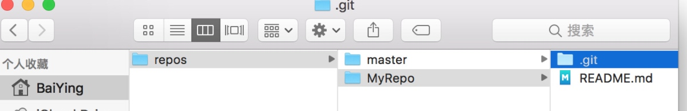
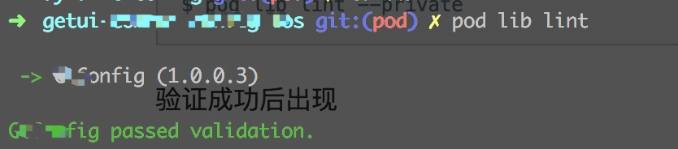
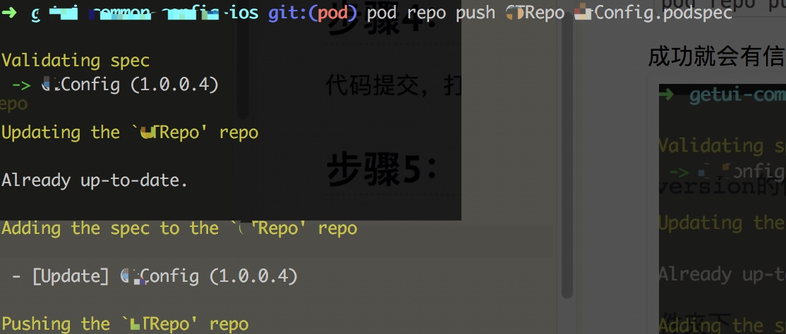

title: CocoaPods创建私有Pods
date: 2017-8-9 21:12:12
tags: CocoaPods
toc: true
---

# CocoaPods创建私有Pods

## 概况：
创建两个仓库

```
1. 作为版本库索引（MyRepo）,成功后本地最终会有一个目录

.cocoapods/repos/MyRepo

和公有的仓库master并列。

2. 私有的代码仓库，静态库，代码存放地方。

```

<!--more-->

## 步骤1：
新建远程空白仓库
将远程的MyPepo添加到本地

```
pod repo add MyRepo https://XXXXX.git
```



## 步骤2：

创建代码仓库，添加代码（a, framework）文件，XX.podspec, LICENSE文件。

```
注意：
1、XX.podspec 文件是关键，填好代码的寻找路径，他不一定要和xcodepro文件或者代码在同一个目录
2、LICENSE只是为了在做pod检查的时候没有警告，有些系统是会找不到MIT等文件的。
```

```
s.license      = "MIT"
修改为，指定文件
s.license      = { :type => "MIT", :file => "LICENSE" }
```


## 步骤2.1

创建podspec 
 
```
pod spec create MyAdditions
```

或者找一个拷贝：

```
Pod::Spec.new do |s|
  s.name         = "MyAdditions" # 项目名称
  s.version      = "0.0.1"        # 版本号 与 你仓库的 标签号 对应
  s.license      = "MIT"          # 开源证书
  s.summary      = "私人pod代码" # 项目简介

  s.homepage     = "https://git.oschina.net/baiyingqiu/MyAdditions" # 仓库的主页
  s.source       = { :git => "https://git.oschina.net/baiyingqiu/MyAdditions.git", :tag => "#{s.version}" }#你的仓库地址，不能用SSH地址
  s.source_files = "MyAdditions/*.{h,m,c}"   s.requires_arc = true # 是否启用ARC
  s.platform     = :ios, "7.0" #平台及支持的最低版本
  # s.frameworks   = "UIKit", "Foundation" #支持的框架
  # s.dependency   = "AFNetworking" # 依赖库

  # User
  s.author             = { "BY" => "qiubaiyingios@163.com" } # 作者信息
  s.social_media_url   = "http://qiubaiying.github.io" # 个人主页

end
```


## 步骤3：
检查podspec文件

```
pod lib lint
```

直到验证成功


## 步骤4：
代码提交，打上tag  tag值要和version的值一致，不然会在发布的时候找不到代码。

## 步骤5(发布)：
在MyAdditions.podspec 的文件夹下

```
pod repo push MyRepo MyAdditions.podspec
```

成功就会有信息


## 使用：
Podflie 文件中加上源

```
source ‘https://XXX/MyRepo.git’
```

最后变成

```
source ‘https://github.com/CocoaPods/Specs.git’
source ‘https://xxx/MyRepo.git’

platform :ios, '8.0'
    target ‘MyPodTest’ do
    pod ‘MyAdditions’ #我们的私有库
end
```


